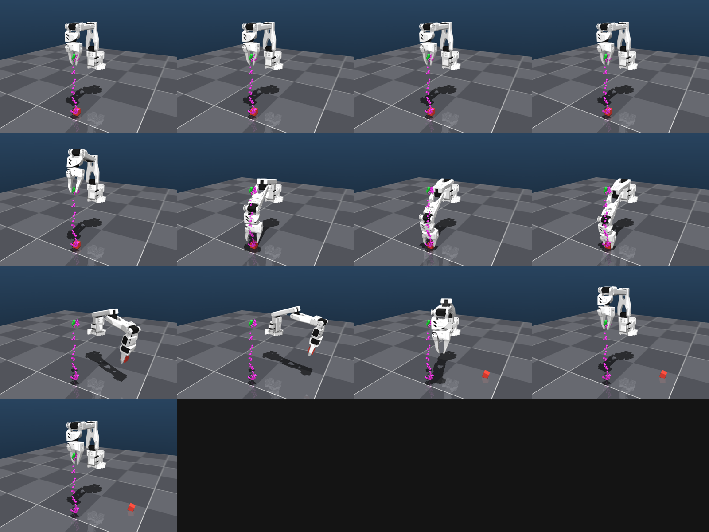
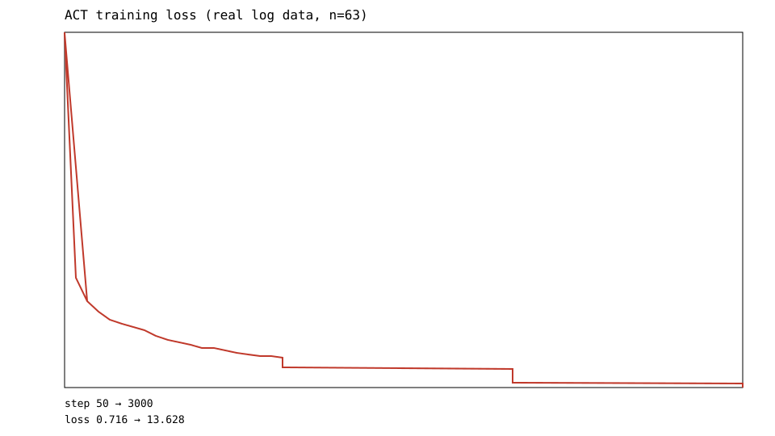
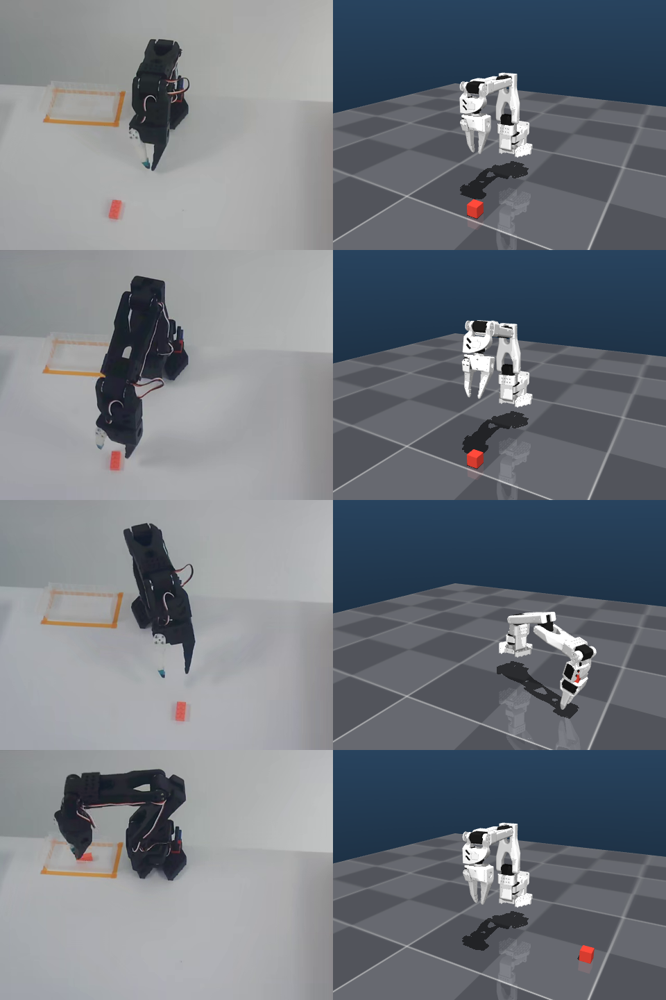
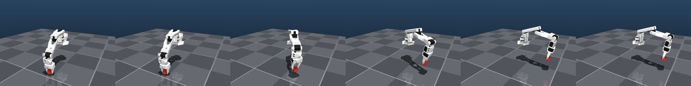

# ACT-so101

**SO-101 机械臂上的 LeRobot ACT 实验台**：从数据集校验、CUDA 训练、TorchScript 导出，到 C++（LibTorch）新进程重载与 ~12.7 ms 低延时推理，并用 MuJoCo 把真实抓取过程、专家/预测轨迹差异与物理抓取稳定性可视化出来。

> **English** — A reproducible [LeRobot ACT](https://github.com/huggingface/lerobot) lab on the SO-101 arm: dataset audit, CUDA training (3 000 steps), TorchScript export, C++/LibTorch inference at ~12.7 ms mean latency, plus MuJoCo visualization of real grasp replay, expert-vs-predicted end-effector trajectories and physics-based grasp stability.

<p align="center">
  
  
</p>

> ⚠️ **评测类型：Offline Evaluation**。本项目未接真机、未接仿真环境，**仿真成功率 / 真机成功率一律 `NOT_MEASURED`**；离线动作误差不等于任务成功率，请勿混用。

---

## 目录

- [1. 这是什么](#1-这是什么)
- [2. 关键结果（全部为实测）](#2-关键结果全部为实测)
- [3. 硬件与软件环境](#3-硬件与软件环境)
- [4. 数据集](#4-数据集)
- [5. 方法与实现](#5-方法与实现)
- [6. 快速开始](#6-快速开始)
- [7. 复现全流程](#7-复现全流程)
- [8. 目录结构](#8-目录结构)
- [9. 证据与文档导航](#9-证据与文档导航)
- [10. 诚实性披露](#10-诚实性披露)
- [11. 本仓库包含 / 不包含](#11-本仓库包含--不包含)
- [12. 已知限制与后续](#12-已知限制与后续)
- [13. 许可与致谢](#13-许可与致谢)
- [14. 变更记录](#14-变更记录)

---

## 1. 这是什么

一个**端到端跑通、并且每条结论都有落盘证据**的 ACT（Action Chunking Transformer）复现项目：

1. **数据侧**：下载并审计 `lerobot/svla_so101_pickplace`（v3.0 数据集格式），校验 schema、相机键、state/action 维度，导出真实帧供核对。
2. **训练侧**：在独立 conda 环境用 LeRobot 官方 trainer 训练 ACT（3 000 步，CUDA），产出 checkpoint 与 loss 曲线。
3. **部署侧**：把策略导出为 TorchScript，用 **C++（LibTorch）新进程**重新加载并前向，验证「跨进程可重载」这条硬门禁，并测量推理延时。
4. **可视化侧**：把 MuJoCo Menagerie 的 SO-ARM100 模型接上真实轨迹，在桌面上回放**真实抓取过程**（含物体），并做专家 vs 预测轨迹叠加、物理抓取稳定性实验。

上游工程实现（阶段编排、证据采集、报告生成）是一个 C++17 CLI `actlab`，Python 只出现在数据集扫描、TorchScript 导出、离线评测与 MuJoCo 可视化这几个明确调用点上。

## 2. 关键结果（全部为实测）

| 环节 | 结果 | 证据 |
| --- | --- | --- |
| 环境 / CUDA | PASS（sm_120 可用，capability 12.0） | `logs/00_hardware_check.txt`、`logs/02_cuda_pytorch.txt` |
| GPU 自检 | `GPU_SMOKE_PASS`（1024×1024 CUDA matmul） | `logs/02_gpu_smoke.txt` |
| 数据集 schema | 0 问题（50 episodes / 11 939 frames / 30 fps / 2 相机 / state=action=6） | `logs/08_dataset_schema.md` |
| ACT 前向 + 反向 | `PROBE_PASS`（loss 有限、反向有梯度） | `logs/11_act_forward_probe.txt` |
| 训练 | 3 000 步，loss **13.628 → 0.716**，27 samples/s，峰值显存 3.69 GB，15.3 min | `results/loss_curve.csv`、`logs/13_training_release.txt` |
| TorchScript 导出 | 与官方 pipeline 数值一致（max_abs_diff = 0.0；freeze+reload 相对差 3.59e-4） | `artifacts/act_baseline/torchscript/equivalence.json` |
| 新进程重载 | `NEW_PROCESS_RELOAD_PASS`（独立进程加载 `.pt` 并前向） | `logs/16_model_reload.txt` |
| C++ 推理延时 | mean **12.69 ms** / p95 **14.05 ms**（warmup 5 + 30 次） | `results/inference_latency.csv` |
| C++ vs Python | 最大绝对差 **0.0445**（相对 ~4e-4） | `logs/18_evaluation.txt` |
| 离线动作误差 | 8 个真实样本，平均 MAE **7.26**（最差样本 19.35） | `results/eval_summary.md` |
| 专家 vs 预测轨迹 | 末端 MAE **0.1206 m**、最大偏差 0.2601 m、末端差 0.2567 m | `results/so101_mujoco/trajectory_compare.json` |
| 物理抓取稳定性 | 4 档尺寸（1.00×/1.05×/1.10×/1.20×）**全部 HELD**，默认取 1.05× | `results/so101_mujoco/physics_summary.md` |
| 证据完整性 | 21/21 截图 + 配对环境日志，缺失 0 | `evidence/index.md` |

> 说明：同一次推理在 S14 与离线评测中各测了一轮，均值分别为 12.69 ms 与 12.49 ms，两处都如实保留在 `results/inference_latency.csv` 与 `results/eval_summary.md`。

## 3. 硬件与软件环境

| 项 | 值 |
| --- | --- |
| 主机 OS | Ubuntu 26.04.1 LTS（Wayland 会话，XWayland `:0`） |
| GPU | NVIDIA GeForce RTX 5070 Laptop GPU（compute capability 12.0 / `sm_120`） |
| 训练环境 | conda env `lerobot_act`（Python 3.12） |
| 训练侧 PyTorch | `torch 2.11.0+cu130`、`torchvision 0.26.0+cu130`（满足 LeRobot 的 `torch>=2.7,<2.12`） |
| LeRobot | `0.6.2`，commit `c73cec56b04f50ebe9286c79905103866d970169` |
| C++ 侧 | C++17 + CMake；LibTorch `2.12.0+cu132`（跨版本加载，已实测通过） |
| 可视化 | MuJoCo（`mujoco 3.13.0`）+ MuJoCo Menagerie `trs_so_arm100` |

环境锁文件：`configs/conda_env.lock.yml`（安装时快照）、`logs/pip_freeze.txt`（pip freeze 原文）。

## 4. 数据集

| 项 | 值 |
| --- | --- |
| repo_id | `lerobot/svla_so101_pickplace` |
| codebase_version | `v3.0` |
| 规模 | 50 episodes / 11 939 frames / 30 fps |
| 相机 | `observation.images.up`、`observation.images.side`（480×640） |
| 动作/状态 | 6 / 6 维（SO-101 关节角，单位：度） |

数据本体不入库（见第 11 节），下载后落在 `$HF_LEROBOT_HOME/<repo_id>`，本项目默认使用 `/home/violet/Workspace/Data/lerobot_act`，由 `configs/paths.yaml` 指定。

## 5. 方法与实现

### 5.1 ACT 超参（唯一事实源 `configs/act_baseline.yaml`）

| 参数 | 值 | 参数 | 值 |
| --- | --- | --- | --- |
| chunk_size | 100 | n_action_steps | 16 |
| n_obs_steps | 1 | vision_backbone | resnet18 |
| dim_model / n_heads | 512 / 8 | dim_feedforward | 3 200 |
| encoder / decoder layers | 4 / 1 | VAE encoder layers | 4 |
| use_vae / latent_dim / kl_weight | true / 32 / 10 | dropout | 0.1 |
| batch_size | 8 | lr / weight_decay | 1e-5 / 1e-4 |
| optimizer | adamw | steps / seed | 3 000 / 1 000 |
| 配置哈希 | `e89e2540cd81310e79cce4279953712f6c2a7dbebed5b7c5c283fc9c66d1a3be` | 模型参数量 | 51 597 190 |

### 5.2 C++ 模块

| 构建目标 | 入口 | 职责 |
| --- | --- | --- |
| `actlab`（`build/gpu`） | `cpp/apps/actlab_main.cpp` | 全流程编排：`env / repo / install / dataset / train / verify / infer / eval / evidence / report` |
| `actlab_local`（`build/local`） | 同一入口，不带 LibTorch | 纯逻辑校验、配置与 schema 审计 |
| `gpu_smoke` | `cpp/apps/gpu_smoke_main.cpp` | LibTorch CUDA 能力与显存自检 |
| `infer_act` | `cpp/apps/infer_act_main.cpp` | 独立进程加载 TorchScript 并前向（重载硬门禁） |
| `actlab_tests` | `cpp/tests/*` | 纯逻辑单元测试（不依赖 GPU / 网络） |

### 5.3 MuJoCo 可视化（`scripts/py/so101_mujoco_view.py`）

把数据集里的真实关节角接到 MuJoCo Menagerie 的 SO-ARM100 模型上（6 关节与数据集 6 维 state 一一对应），并做了三件不写死帧号的事：

1. **零点对齐**：以 episode 首帧对齐模型 home 姿态，补偿伺服标定零点差异；
2. **物体就位**：取夹爪**指垫**中心轨迹的最低点作为抓取点，水平面放在该高度，方块尺寸按实测指垫间隙自动确定（避免穿模）；
3. **抓取/松开判定**：由夹爪信号推断（先张开后闭合 = 抓取，其后重新张开 = 松开），抓取期间物体随爪运动，松开后在 12 帧内平落到平面。

<p align="center">
  
  
</p>

支持的模式：

| 模式 | 说明 |
| --- | --- |
| `window` | 桌面 MuJoCo 窗口回放（`start.sh` 的默认行为；`GLFW + --x11`，既能看也能截图留证） |
| `render` | 离屏渲染关键帧 → PNG / montage / mp4 |
| `compare` | 真实相机帧 vs 同一时刻 3D 渲染并排核对（数据自洽性检查） |
| `overlay` | 专家轨迹（绿）与 ACT 预测轨迹（品红）叠加在同一场景 |
| `physics` / `sweep` | 把专家抓取段作为位置伺服目标回放，由 MuJoCo 真实计算接触/摩擦，判定是否 HELD |

## 6. 快速开始

```bash
git clone https://github.com/DeRuiChen258/ACT-so101.git
cd ACT-so101

# 打开桌面仿真窗口，持续循环回放 episode 0（关闭窗口即退出）
./start.sh

# 只回放 5 圈
./start.sh 5
```

`start.sh` 是本仓库**唯一**的启动脚本，它只做一件事：用真实轨迹在 MuJoCo 窗口里回放 SO-101 的抓取过程。

前置条件（路径全部来自 `configs/paths.yaml`，脚本内不写死模型路径）：

1. Python 环境（默认 `CONDA_ROOT=/home/violet/Workspace/miniconda`、`ENV_NAME=lerobot_act`），需含 `mujoco / numpy / pandas / pyarrow / pillow / pyyaml`；
2. 数据集已在 `data_dir` 下（默认 `/home/violet/Workspace/Data/lerobot_act/lerobot/svla_so101_pickplace`）；
3. MuJoCo Menagerie 的 `trs_so_arm100` 模型（`paths.so101_mujoco_model`）。

可用环境变量覆盖：`CONDA_ROOT`、`ENV_NAME`、`ACTLAB_EPISODE`（回放哪个 episode）、`ACTLAB_DISPLAY`（X11 显示号）。

## 7. 复现全流程

> 本仓库只保留 `start.sh` 作为运行入口；下面是与产物一一对应的原生命令，用于复现训练、导出与推理链。

**① 建环境（决策 D1-A：独立 conda 环境，不动宿主环境）**

```bash
conda create -y -n lerobot_act python=3.12
PY=/home/violet/Workspace/miniconda/envs/lerobot_act/bin/python
$PY -m pip install "torch==2.11.0+cu130" "torchvision==0.26.0+cu130" \
    --index-url https://download.pytorch.org/whl/cu130 --extra-index-url https://pypi.org/simple
```

**② LeRobot 源码 + 可编辑安装**（commit `c73cec5`，`pip install -e .[training]`）

```bash
git clone https://gitcode.com/GitHub_Trending/le/lerobot.git /home/violet/Workspace/IDE/Physical_AI/repo
cd /home/violet/Workspace/IDE/Physical_AI/repo && $PY -m pip install -e ".[training]"
```

**③ 数据集**（`HF_LEROBOT_HOME` 指向数据根目录）

```bash
export HF_LEROBOT_HOME=/home/violet/Workspace/Data/lerobot_act
$PY scripts/py/scan_dataset_ref.py --repo-id lerobot/svla_so101_pickplace
```

**④ 训练**（ACT baseline；smoke 用 `--steps=100`，正式跑 `--steps=3000`）

```bash
$PY -m lerobot.scripts.lerobot_train \
  --dataset.repo_id=lerobot/svla_so101_pickplace \
  --dataset.root=$HF_LEROBOT_HOME/lerobot/svla_so101_pickplace \
  --policy.type=act --policy.device=cuda --policy.push_to_hub=false \
  --output_dir=outputs/train/act_baseline --job_name=act_baseline \
  --batch_size=8 --steps=3000 --num_workers=2 --seed=1000 --save_freq=500 --log_freq=50 \
  --policy.optimizer_lr=0.000010 --policy.optimizer_weight_decay=0.000100 \
  --policy.chunk_size=100 --policy.n_action_steps=16 --policy.dim_model=512 --policy.n_heads=8 \
  --policy.dim_feedforward=3200 --policy.n_encoder_layers=4 --policy.n_decoder_layers=1 \
  --policy.n_vae_encoder_layers=4 --policy.latent_dim=32 --policy.dropout=0.100000 \
  --policy.kl_weight=10.000000 --policy.use_vae=true
```

**⑤ TorchScript 导出 + 真实样本导出**

```bash
$PY scripts/py/export_act_torchscript.py \
  --checkpoint outputs/train/act_baseline/checkpoints/last/pretrained_model \
  --out-dir artifacts/act_baseline/torchscript \
  --repo-id lerobot/svla_so101_pickplace \
  --root $HF_LEROBOT_HOME/lerobot/svla_so101_pickplace \
  --samples-dir artifacts/dataset_samples --device cuda
```

**⑥ C++ 侧构建、重载与推理**

```bash
cmake -S cpp -B build/gpu   -DACTLAB_WITH_TORCH=ON  -DCMAKE_BUILD_TYPE=Release
cmake --build build/gpu -j

build/gpu/infer_act --torchscript artifacts/act_baseline/torchscript/act_policy.pt \
  --samples artifacts/dataset_samples --device cuda --out artifacts/reload_output.csv
```

**⑦ 可视化**

```bash
./start.sh 0      # 桌面窗口
MUJOCO_GL=egl $PY scripts/py/so101_mujoco_view.py --mode=render  --stride=25 --width=640 --height=480 ...
MUJOCO_GL=egl $PY scripts/py/so101_mujoco_view.py --mode=physics --object-size-scale=1.05 ...
```

> 注意：自动报告阶段（`actlab report`）历史上会**重新生成 `README.md`**。若要保留本文件，运行前先备份。

## 8. 目录结构

| 目录 | 放什么 | 不放什么 |
| --- | --- | --- |
| `cpp/` | C++17 主工程源码（`apps/` 入口、`include/actlab/` 头、`src/` 实现、`tests/`） | 运行期产物 |
| `configs/` | 唯一超参事实源：`act_baseline.yaml` / `paths.yaml` / `runtime.yaml` / 环境锁 | 日志 |
| `scripts/py/` | 数据集扫描、TorchScript 导出、离线评测、MuJoCo 可视化（Python 调用点全部登记在 `logs/hybrid_boundary.md`） | 训练产物 |
| `logs/` | 全量终端日志、指标 JSONL、GPU 监控、分析文档 | 截图 |
| `evidence/` | 真实截图 + 证据索引（`index.md`，含哈希与时间戳） | 日志副本 |
| `results/` | 曲线、拼图、评测摘要、MuJoCo 可视化产物 | 原始训练日志 |
| `artifacts/` | TorchScript、导出真实样本（`.npy`）、等价性 JSON | 数据集本体 |
| `outputs/` | `lerobot-train` 原始输出（checkpoint）——**不入库** | — |
| `build/` | CMake 构建产物 ——**不入库** | 源码 |

`data/` 与 `repo/` 在本机是指向环境层的软链接，**不入库**。

## 9. 证据与文档导航

| 想了解 | 看这里 |
| --- | --- |
| 每个阶段长什么样（截图） | `evidence/index.md`（21 行，含截图哈希与时间戳） |
| 具体命令的原始输出 | `logs/`（65 个文件，命名 `NN_阶段.*`） |
| 产物哈希与命令清单 | `experiment_manifest.json`（393 条产物 + 54 条命令） |
| 训练曲线数据 | `results/loss_curve.csv`、`results/loss_curve.png` |
| 推理延时 | `results/inference_latency.csv` |
| 离线评测 | `results/eval_summary.md` |
| 抓取可视化与物理实验 | `results/so101_mujoco/`（关键帧、montage、mp4、JSON） |
| 项目全过程台账 | `TASK.md`（阶段门禁与自审） |
| 关键决策与取舍 | 本文件第 10 节「诚实性披露」 |
| 踩过的坑与修复 | `logs/` 中对应阶段的 FAIL / DEGRADED 记录 |

## 10. 诚实性披露

以下偏差与限制都在产物里可查，不做粉饰：

1. **评测类型**：只有离线评测（数据集回放 + 动作误差 + 推理延时）。**仿真成功率、真机成功率、真实机器人动作执行一律 `NOT_MEASURED`**。
2. **模型精度**：3 000 步、无超参搜索。末端轨迹 MAE 0.1206 m、最大偏差 0.2601 m，说明当前策略与专家轨迹仍有明显差距；离线动作 MAE 平均 7.26（度），最差样本 19.35。
3. **C++/Python 数值差异**：最大绝对差 0.0445（相对 ~4e-4），来源为设备/精度差异，尚未完全定位，`results/eval_summary.md` 中已标注「需检查」。
4. **数据集来源**：走 HuggingFace Hub 直连下载（ModelScope 镜像需额外依赖，本轮未走）。
5. **Python 调用点**：提示词原文「仅允许 4 处」与实际阶段表要求的 5 个脚本存在不一致，按「进程级 ≤4 + 库级复用」执行，完整登记见 `logs/hybrid_boundary.md`。
6. **截图方式**：本机 Wayland 会话下整屏抓取不可用（实测），证据统一采用「真实窗口运行真实命令 → 按窗口 id 抓取」，见 `evidence/README.md`。
7. **LibTorch 版本**：C++ 侧复用宿主既有 LibTorch 2.12.0+cu132（训练侧为 torch 2.11.0+cu130），跨版本加载结果以 `logs/16_model_reload.txt` 实测为准。
8. **环境事故（2026-09-19 20:23）**：conda 环境 `lerobot_act` 曾被重新创建，`lerobot` 与可视化依赖丢失，数据集/模型/产物未受影响。可视化依赖（`mujoco 3.13.0` 等）已按原版本恢复并现场验证；若重跑训练链，需重新执行第 7 节 ② 的 LeRobot 安装。

## 11. 本仓库包含 / 不包含

**包含**：C++ 源码、Python 工具、配置、启动脚本、实验日志、截图证据、图表与 JSON 结果、导出样本（`.npy`，约 59 MB）、TorchScript 等价性记录。

**不包含**（体积或可再生成原因，已由 `.gitignore` 排除）：

| 未入库内容 | 体积 | 如何获得 |
| --- | --- | --- |
| `results/*.rrd` | 4.5 GB | 用 LeRobot 数据集可视化重新生成 |
| `outputs/train/**`（checkpoint） | 4.1 GB | 按第 7 节 ④ 重新训练（3000 步约 15 min） |
| `artifacts/**/act_policy.pt` | 141 MB | 按第 7 节 ⑤ 从 checkpoint 重新导出 |
| `data/`、`repo/` | — | 本机指向环境层的软链接 |
| `build/` | 27 MB | CMake 重新构建 |

## 12. 已知限制与后续

- 未接真机 / 未接仿真环境 → 无法给出成功率；下一步应把策略接入 MuJoCo 物理场景或真机做闭环评测。
- 训练步数偏少、未做超参搜索与多 seed 统计 → 现有指标不能作为「方法优劣」的结论。
- 轨迹偏差较大（0.12 m 量级）→ 建议增加训练步数、检查相机外参与动作归一化。
- 可视化里的物体抓取为**由真实轨迹推断的运动学回放**（`window/render/compare/overlay` 模式），只有 `physics/sweep` 模式是 MuJoCo 真实接触与摩擦。

## 13. 许可与致谢

MIT License（见 [LICENSE](LICENSE)）。

致谢：

- [huggingface/lerobot](https://github.com/huggingface/lerobot) —— ACT 实现、训练器与数据集格式；
- [MuJoCo](https://github.com/google-deepmind/mujoco) 与 [MuJoCo Menagerie](https://github.com/google-deepmind/mujoco_menagerie)（`trs_so_arm100` 模型）；
- 数据集 [lerobot/svla_so101_pickplace](https://huggingface.co/datasets/lerobot/svla_so101_pickplace)；
- PyTorch / LibTorch。

## 14. 变更记录

### v0.1.0 — 2026-09-19

- 跑通 S0–S16 全链：环境 → 源码 → 安装 → 数据集 → ACT 探针 → 训练（100 步 smoke + 3 000 步 release）→ checkpoint → TorchScript → 新进程重载 → C++ 推理 → 离线评测 → 证据 → 报告。
- 新增 SO-101 MuJoCo 可视化：窗口回放、离屏渲染、真实帧对照、专家 vs 预测轨迹叠加、物理抓取稳定性扫描。
- 启动入口收敛为唯一的 `start.sh`；配套 `.gitignore` 排除 checkpoints / `.rrd` / TorchScript 等大体积产物。
